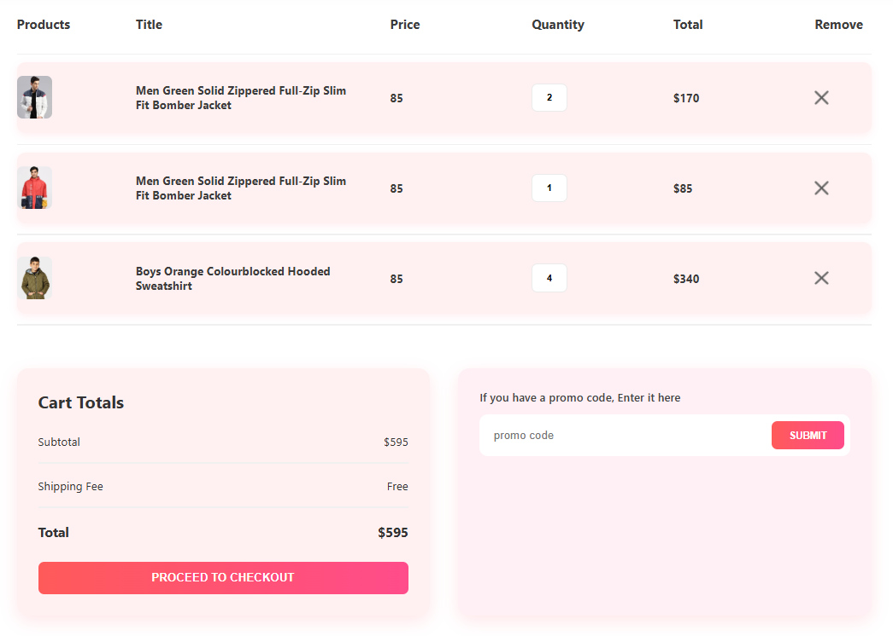
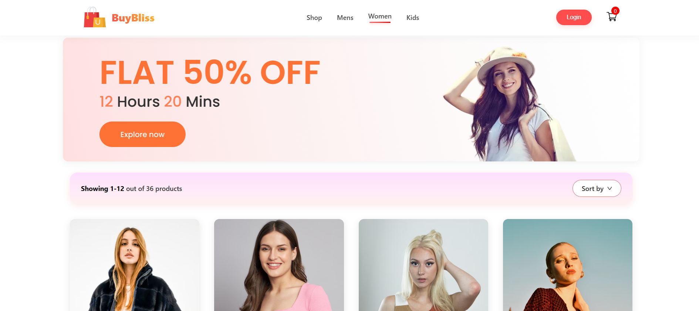
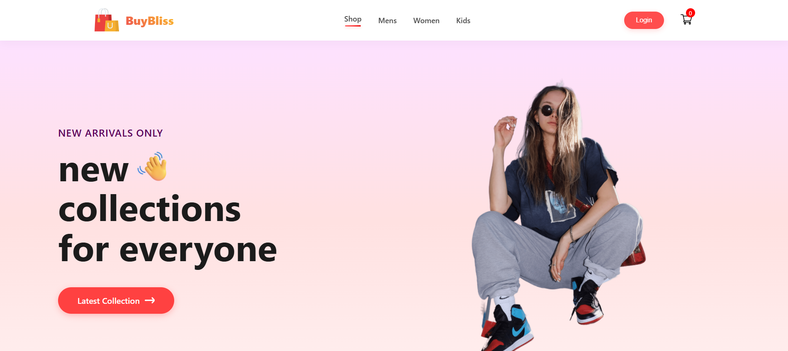
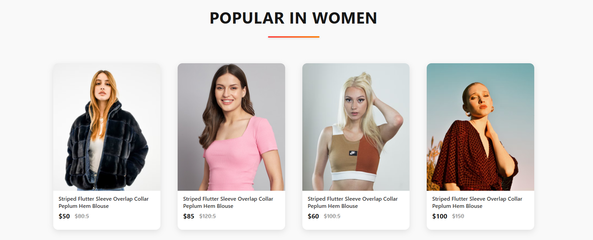

# 🛍️ SHOPPER - E-commerce React App

BuyBliss is a stylish and responsive e-commerce website built with **React.js**. It offers a seamless shopping experience with features like product listings, category filtering, cart management, and more.

## 🌟 Features

- 🧭 Easy navigation with sticky navbar
- 🛒 Add-to-cart functionality using Context API
- 👕 Product categories: Men, Women, Kids
- 💬 Product description and review sections
- ✉️ Newsletter subscription
- 🎨 Clean and modern UI using custom CSS

## 🚀 Live Preview

_**Coming Soon!**_ 

## 🛠️ Tech Stack

- React.js
- JavaScript (ES6+)
- Context API
- React Router DOM
- Custom CSS / CSS Modules

## 🖼️ Screenshots

| Cart Page | Category Section | Hero Section | Home Page |
|-----------|------------------|---------------|------------|
|  |  |  |  |

